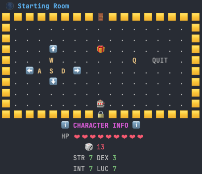

# ReRollRPG

         ___           ___           ___           ___           ___       ___ 
        /\  \         /\  \         /\  \         /\  \         /\__\     /\__\
       /::\  \       /::\  \       /::\  \       /::\  \       /:/  /    /:/  /
      /:/\:\  \     /:/\:\  \     /:/\:\  \     /:/\:\  \     /:/  /    /:/  / 
     /::\~\:\  \   /::\~\:\  \   /::\~\:\  \   /:/  \:\  \   /:/  /    /:/  /  
    /:/\:\ \:\__\ /:/\:\ \:\__\ /:/\:\ \:\__\ /:/__/ \:\__\ /:/__/    /:/__/   
    \/_|::\/:/  / \:\~\:\ \/__/ \/_|::\/:/  / \:\  \ /:/  / \:\  \    \:\  \   
       |:|::/  /   \:\ \:\__\      |:|::/  /   \:\  /:/  /   \:\  \    \:\  \  
       |:|\/__/     \:\ \/__/      |:|\/__/     \:\/:/  /     \:\  \    \:\  \ 
       |:|  |        \:\__\        |:|  |        \::/  /       \:\__\    \:\__\
        \|__|         \/__/         \|__|         \/__/         \/__/     \/__/  
                            ________ ________ _________
                            ___  __ \___  __ \__  ____/
                            __  /_/ /__  /_/ /_  / __
                            _  _, _/ _  ____/ / /_/ /
                            /_/ |_|  /_/      \____/

**ReRollRPG** is a turn-based, text-based dungeon crawler with a twist — fate isn’t set in stone. Your stats, class, and even your dungeon runs can shift with a lucky (or unlucky) roll of the dice. Fight enemies, find rewards, drink mysterious water, and survive until you face the final boss… or die trying.

---

## Features
- **Randomized Character Creation** – Roll your stats and get two random classes to choose from. Higher-tier classes are harder to get.
- **Procedurally Generated Maps** – Each level generates walls, rooms, enemies, rewards, and special tiles.
- **Turn-Based Combat** – Your attacks scale based on your class’s main stat. Strategy matters.
- **Mysterious Rewards & Water Tiles** – Boost stats, heal up, or get unexpected effects.
- **Boss Fight Finale** – Level 4 is a one-room showdown with the big bad.
- **Humorous & Slightly Sinister Writing** – The dungeon has jokes… and teeth.

---

## How to Play
1. **Run the game in a proper terminal**  
   It’s recommended to play in a system terminal (Command Prompt, macOS Terminal, or Linux shell). IDE command lines (like PyCharm’s or VSCode’s) may break formatting and colors.
   
2. **Launch the game**
   ```bash
   python3 game.py
   ```
   
3. **Create your character**
   - Roll your stats.
   - Pick one of the two classes offered.
   - If you don’t like your options, re-roll… at your own risk.

4. **Explore the dungeon**
   - Navigate with movement commands (`WASD` or arrow keys if supported).
   - Enter rooms, fight enemies, and collect loot.
   - Watch out for water tiles — not all hydration is safe.

5. **Clear levels**
   - Defeat enemies to unlock doors.
   - Progress deeper until you reach the boss.

6. **Try again**
   - Each run is unique thanks to randomized maps, enemies, and events.

---

## Tips
- Your main stat matters more than you think.
- Don’t ignore the water tiles — sometimes they’re the best way to survive.
- Remember: even when you win, the dungeon has a way of… making you start over.

---

## Requirements
- Python 3.8+
- Runs best in a standard terminal (supports ANSI escape colors).
- No external dependencies — just run and play.

---

## Example Screenshot


```
You find yourself at the dungeon's entrance.
What could possibly go wrong?
```
